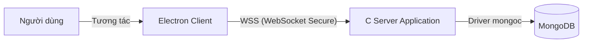

# 2. KIẾN TRÚC HỆ THỐNG

## 2.1. Mô hình tổng quát
Hệ thống hoạt động theo mô hình **Client-Server** với giao thức truyền tải được nâng cấp lên WebSocket để hỗ trợ tương tác thời gian thực tốt hơn trong môi trường web/electron.

## 2.2. Chi tiết các thành phần

### 2.2.1. Client (Electron Dashboard)
- **Công nghệ**: Electron, React (hoặc HTML/JS thuần tùy implementation hiện tại), CSS.
- **Nhiệm vụ**:
    - Hiển thị giao diện người dùng (Dashboard, Calendar, Forms).
    - Duy trì kết nối WebSocket tới Server.
    - Đóng gói các lệnh (Command) thành chuỗi ký tự theo định dạng bản tin.
    - Phân tích phản hồi (Response) từ Server để cập nhật UI.

### 2.2.2. Server (C Application)
- **Công nghệ**: Ngôn ngữ C, Thư viện WebSocket (ví dụ: libwebsockets hoặc tương đương), Thư viện MongoDB C Driver.
- **Nhiệm vụ**:
    - Lắng nghe kết nối tại cổng (ví dụ: 8080 hoặc 1234 qua lớp WSS).
    - **Parser**: Phân tích chuỗi bản tin nhận được từ Client.
    - **Controller**: Xử lý logic nghiệp vụ (Đăng ký, Đăng nhập, Đặt lịch...).
    - **Data Access**: Thực hiện truy vấn (CRUD) vào MongoDB.
    - Phản hồi kết quả về cho Client.

### 2.2.3. Database (MongoDB)
- **Công nghệ**: MongoDB.
- **Triển khai**: Sử dụng dịch vụ **MongoDB Atlas** (Cloud Database) để đảm bảo khả năng truy cập từ mọi nơi và dễ dàng tích hợp.
- **Nhiệm vụ**:
    - Lưu trữ thông tin người dùng (Users).
    - Lưu trữ lịch rảnh (Slots).
    - Lưu trữ cuộc họp và biên bản (Meetings & Minutes).
    *Thay thế cho kiến trúc cũ (MySQL + File System) để tăng tính linh hoạt và hiệu suất.*

## 2.3. Luồng xử lý (Data Flow)
1.  **Client** gửi Request (dạng Text Command) qua WebSocket connection.
2.  **Server** nhận gói tin, sử dụng bộ Parser để tách `COMMAND`, `TOKEN`, `DATA`.
3.  **Server** xác thực Token (nếu cần).
4.  **Server** gọi hàm xử lý tương ứng, truy xuất **MongoDB**.
5.  **Server** đóng gói kết quả thành Response và gửi lại qua WebSocket.

